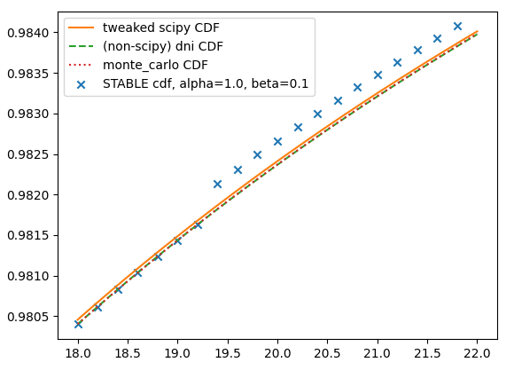

# levy-stable-benchmarks

Stable distributions (sometimes called Lévy alpha-stable distributions) are
important for modelling data across several disciplines including signal
processing, physics, and finance. Despite this, many Python libraries
provide buggy and/or inaccurate implementations for computing its PDF/CDF.

This repository attempts to define a benchmark to test the accuracy of
such implementations. We also provide some alternative calculation methods.

Among other things, this repository has helped to
 * Identify a typo in Theorem 1, case (d) of Nolan's original paper, [Numerical calculation of stable densities and distribution functions](https://www.tandfonline.com/doi/abs/10.1080/15326349708807450). This is corrected in [Nolan's new textbook](https://www.springer.com/us/book/9783030529147).
 * Further progress on [a scipy PR to improve stable distribution computations](https://github.com/scipy/scipy/pull/9523).
 * Identify [some issues in pylevy](https://github.com/josemiotto/pylevy/issues/15), a Python package for applications involving stable distributions.

# Table of Contents
 * [CDF accuracy percentages](#CDFAccuracy)
 * [PDF accuracy percentages](#PDFAccuracy)
 * [Average runtimes](#AverageRuntimes)
 * [FAQ, notes, and limitations](#FAQ)

## CDF accuracy percentages

### CDF table (-100 <= x <= 100)

<table>
  <tr><td></td><td colspan="4"><b>Absolute</b> Tolerance</td></tr>
  <tr><td>Method</td><td>1E-2</td><td>1E-3</td><td>1E-4</td><td>1E-5</td></tr>
  <tr>
    <td>simple_quadrature</td>
    <td>99.9%</td><td>99.9%</td><td>99.6%</td><td>99.4%</td>
  </tr>
  <tr>
    <td>simple_monte_carlo</td>
    <td>100.0%</td><td>99.9%</td><td>66.5%</td><td>22.8%</td>
  </tr>
  <tr>
    <td>larger_monte_carlo</td>
    <td>100.0%</td><td>100.0%</td><td>99.6%</td><td>71.3%</td>
  </tr>
  <tr>
    <td>scipy_best</td>
    <td>99.7%</td><td>99.5%</td><td>97.0%</td><td>89.8%</td>
  </tr>
  <tr>
    <td>pylevy_miotto</td>
    <td>83.5%</td><td>78.0%</td><td>68.9%</td><td>58.1%</td>
  </tr>
</table>

<table>
  <tr><td></td><td colspan="4"><b>Relative</b> Tolerance</td></tr>
  <tr><td>Method</td><td>1E-1</td><td>1E-2</td><td>1E-3</td><td>1E-4</td></tr>
  <tr>
    <td>simple_quadrature</td>
    <td>98.9%</td><td>98.9%</td><td>98.9%</td><td>98.6%</td>
  </tr>
  <tr>
    <td>simple_monte_carlo</td>
    <td>91.2%</td><td>70.9%</td><td>60.0%</td><td>31.6%</td>
  </tr>
  <tr>
    <td>larger_monte_carlo</td>
    <td>99.8%</td><td>92.7%</td><td>81.2%</td><td>58.2%</td>
  </tr>
  <tr>
    <td>scipy_best</td>
    <td>90.4%</td><td>90.4%</td><td>90.4%</td><td>90.1%</td>
  </tr>
  <tr>
    <td>pylevy_miotto</td>
    <td>81.8%</td><td>66.7%</td><td>54.0%</td><td>42.3%</td>
  </tr>
</table>

### CDF quantile table (0.001 <= p <= 0.999)

<table>
  <tr><td></td><td colspan="4"><b>Absolute</b> Tolerance</td></tr>
  <tr><td>Method</td><td>1E-2</td><td>1E-3</td><td>1E-4</td><td>1E-5</td></tr>
  <tr>
    <td>simple_quadrature</td>
    <td>99.2%</td><td>99.1%</td><td>99.1%</td><td>99.1%</td>
  </tr>
  <tr>
    <td>simple_monte_carlo</td>
    <td>100.0%</td><td>99.7%</td><td>22.4%</td><td>2.2%</td>
  </tr>
  <tr>
    <td>larger_monte_carlo</td>
    <td>100.0%</td><td>100.0%</td><td>99.7%</td><td>22.0%</td>
  </tr>
  <tr>
    <td>scipy_best</td>
    <td>99.9%</td><td>99.9%</td><td>99.9%</td><td>99.9%</td>
  </tr>
  <tr>
    <td>pylevy_miotto</td>
    <td>85.9%</td><td>80.7%</td><td>78.8%</td><td>77.5%</td>
  </tr>
</table>

<table>
  <tr><td></td><td colspan="4"><b>Relative</b> Tolerance</td></tr>
  <tr><td>Method</td><td>1E-1</td><td>1E-2</td><td>1E-3</td><td>1E-4</td></tr>
  <tr>
    <td>simple_quadrature</td>
    <td>99.2%</td><td>99.1%</td><td>99.1%</td><td>99.1%</td>
  </tr>
  <tr>
    <td>simple_monte_carlo</td>
    <td>100.0%</td><td>99.0%</td><td>76.6%</td><td>8.3%</td>
  </tr>
  <tr>
    <td>larger_monte_carlo</td>
    <td>100.0%</td><td>100.0%</td><td>99.7%</td><td>70.8%</td>
  </tr>
  <tr>
    <td>scipy_best</td>
    <td>99.9%</td><td>99.9%</td><td>99.9%</td><td>99.9%</td>
  </tr>
  <tr>
    <td>pylevy_miotto</td>
    <td>92.7%</td><td>83.0%</td><td>79.8%</td><td>78.1%</td>
  </tr>
</table>

### Nolan CDF quantile table (0.00001 <= p <= 0.99999)

<table>
  <tr><td></td><td colspan="4"><b>Absolute</b> Tolerance</td></tr>
  <tr><td>Method</td><td>1E-2</td><td>1E-3</td><td>1E-4</td><td>1E-5</td></tr>
  <tr>
    <td>simple_quadrature</td>
    <td>96.2%</td><td>95.9%</td><td>95.7%</td><td>95.6%</td>
  </tr>
  <tr>
    <td>simple_monte_carlo</td>
    <td>99.4%</td><td>98.9%</td><td>44.0%</td><td>14.8%</td>
  </tr>
  <tr>
    <td>larger_monte_carlo</td>
    <td>99.4%</td><td>99.1%</td><td>98.8%</td><td>47.8%</td>
  </tr>
  <tr>
    <td>scipy_best</td>
    <td>99.1%</td><td>98.7%</td><td>97.9%</td><td>92.6%</td>
  </tr>
  <tr>
    <td>pylevy_miotto</td>
    <td>91.5%</td><td>87.9%</td><td>83.4%</td><td>77.7%</td>
  </tr>
</table>

<table>
  <tr><td></td><td colspan="4"><b>Relative</b> Tolerance</td></tr>
  <tr><td>Method</td><td>1E-1</td><td>1E-2</td><td>1E-3</td><td>1E-4</td></tr>
  <tr>
    <td>simple_quadrature</td>
    <td>96.2%</td><td>95.8%</td><td>95.8%</td><td>95.6%</td>
  </tr>
  <tr>
    <td>simple_monte_carlo</td>
    <td>95.2%</td><td>84.5%</td><td>66.5%</td><td>21.0%</td>
  </tr>
  <tr>
    <td>larger_monte_carlo</td>
    <td>99.4%</td><td>95.9%</td><td>88.6%</td><td>64.4%</td>
  </tr>
  <tr>
    <td>scipy_best</td>
    <td>96.2%</td><td>95.8%</td><td>95.7%</td><td>95.4%</td>
  </tr>
  <tr>
    <td>pylevy_miotto</td>
    <td>93.7%</td><td>86.0%</td><td>79.5%</td><td>71.5%</td>
  </tr>
</table>

## PDF accuracy percentages

### PDF table (-100 <= x <= 100)

<table>
  <tr><td></td><td colspan="4"><b>Absolute</b> Tolerance</td></tr>
  <tr><td>Method</td><td>1E-4</td><td>1E-5</td><td>1E-6</td><td>1E-7</td></tr>
  <tr>
    <td>simple_quadrature</td>
    <td>99.9%</td><td>99.9%</td><td>99.9%</td><td>99.9%</td>
  </tr>
  <tr>
    <td>scipy_best</td>
    <td>99.8%</td><td>98.8%</td><td>94.9%</td><td>89.5%</td>
  </tr>
  <tr>
    <td>scipy_zolotarev</td>
    <td>98.2%</td><td>96.6%</td><td>92.5%</td><td>87.2%</td>
  </tr>
  <tr>
    <td>scipy_quadrature</td>
    <td>82.6%</td><td>81.0%</td><td>79.5%</td><td>77.8%</td>
  </tr>
  <tr>
    <td>pylevy_miotto</td>
    <td>90.8%</td><td>79.8%</td><td>67.7%</td><td>37.5%</td>
  </tr>
</table>

<table>
  <tr><td></td><td colspan="4"><b>Relative</b> Tolerance</td></tr>
  <tr><td>Method</td><td>1E-1</td><td>1E-2</td><td>1E-3</td><td>1E-4</td></tr>
  <tr>
    <td>simple_quadrature</td>
    <td>97.5%</td><td>97.5%</td><td>97.4%</td><td>97.4%</td>
  </tr>
  <tr>
    <td>scipy_best</td>
    <td>88.3%</td><td>88.3%</td><td>88.3%</td><td>88.2%</td>
  </tr>
  <tr>
    <td>scipy_zolotarev</td>
    <td>86.0%</td><td>86.0%</td><td>85.9%</td><td>85.8%</td>
  </tr>
  <tr>
    <td>scipy_quadrature</td>
    <td>78.1%</td><td>76.4%</td><td>74.4%</td><td>71.3%</td>
  </tr>
  <tr>
    <td>pylevy_miotto</td>
    <td>79.5%</td><td>48.8%</td><td>24.4%</td><td>11.5%</td>
  </tr>
</table>

### PDF quantile table (0.001 <= p <= 0.999)

<table>
  <tr><td></td><td colspan="4"><b>Absolute</b> Tolerance</td></tr>
  <tr><td>Method</td><td>1E-4</td><td>1E-5</td><td>1E-6</td><td>1E-7</td></tr>
  <tr>
    <td>simple_quadrature</td>
    <td>99.8%</td><td>99.8%</td><td>99.8%</td><td>99.7%</td>
  </tr>
  <tr>
    <td>scipy_best</td>
    <td>99.9%</td><td>99.9%</td><td>99.9%</td><td>99.7%</td>
  </tr>
  <tr>
    <td>scipy_zolotarev</td>
    <td>97.5%</td><td>97.5%</td><td>97.4%</td><td>97.3%</td>
  </tr>
  <tr>
    <td>scipy_quadrature</td>
    <td>87.4%</td><td>86.6%</td><td>85.8%</td><td>84.9%</td>
  </tr>
  <tr>
    <td>pylevy_miotto</td>
    <td>85.4%</td><td>82.5%</td><td>77.5%</td><td>55.9%</td>
  </tr>
</table>

<table>
  <tr><td></td><td colspan="4"><b>Relative</b> Tolerance</td></tr>
  <tr><td>Method</td><td>1E-1</td><td>1E-2</td><td>1E-3</td><td>1E-4</td></tr>
  <tr>
    <td>simple_quadrature</td>
    <td>98.6%</td><td>98.5%</td><td>98.4%</td><td>98.4%</td>
  </tr>
  <tr>
    <td>scipy_best</td>
    <td>99.9%</td><td>99.9%</td><td>99.9%</td><td>99.9%</td>
  </tr>
  <tr>
    <td>scipy_zolotarev</td>
    <td>99.0%</td><td>97.9%</td><td>97.5%</td><td>97.4%</td>
  </tr>
  <tr>
    <td>scipy_quadrature</td>
    <td>88.4%</td><td>87.5%</td><td>86.7%</td><td>86.0%</td>
  </tr>
  <tr>
    <td>pylevy_miotto</td>
    <td>85.2%</td><td>79.1%</td><td>77.7%</td><td>75.5%</td>
  </tr>
</table>

### Nolan PDF quantile table (0.00001 <= p <= 0.99999)

<table>
  <tr><td></td><td colspan="4"><b>Absolute</b> Tolerance</td></tr>
  <tr><td>Method</td><td>1E-4</td><td>1E-5</td><td>1E-6</td><td>1E-7</td></tr>
  <tr>
    <td>simple_quadrature</td>
    <td>99.9%</td><td>99.9%</td><td>99.9%</td><td>99.8%</td>
  </tr>
  <tr>
    <td>scipy_best</td>
    <td>99.5%</td><td>99.4%</td><td>98.5%</td><td>96.3%</td>
  </tr>
  <tr>
    <td>scipy_zolotarev</td>
    <td>96.5%</td><td>96.3%</td><td>95.3%</td><td>93.0%</td>
  </tr>
  <tr>
    <td>scipy_quadrature</td>
    <td>79.4%</td><td>78.4%</td><td>77.5%</td><td>76.7%</td>
  </tr>
  <tr>
    <td>pylevy_miotto</td>
    <td>91.9%</td><td>87.0%</td><td>77.9%</td><td>54.4%</td>
  </tr>
</table>

<table>
  <tr><td></td><td colspan="4"><b>Relative</b> Tolerance</td></tr>
  <tr><td>Method</td><td>1E-1</td><td>1E-2</td><td>1E-3</td><td>1E-4</td></tr>
  <tr>
    <td>simple_quadrature</td>
    <td>92.5%</td><td>91.6%</td><td>91.6%</td><td>91.4%</td>
  </tr>
  <tr>
    <td>scipy_best</td>
    <td>93.7%</td><td>93.7%</td><td>93.7%</td><td>93.6%</td>
  </tr>
  <tr>
    <td>scipy_zolotarev</td>
    <td>92.0%</td><td>90.8%</td><td>90.3%</td><td>90.2%</td>
  </tr>
  <tr>
    <td>scipy_quadrature</td>
    <td>78.7%</td><td>77.9%</td><td>77.1%</td><td>75.5%</td>
  </tr>
  <tr>
    <td>pylevy_miotto</td>
    <td>88.3%</td><td>79.8%</td><td>67.5%</td><td>55.3%</td>
  </tr>
</table>

## Average runtimes

The average per-call (single-threaded) runtimes on the benchmark tables are as follows.

<table>
  <tr><td>Method</td><td>CDF average runtime</td><td>PDF average runtime</td></tr>
  <tr><td>simple_quadrature</td><td>4.80 ms</td><td>3.90 ms</td></tr>
  <tr><td>simple_monte_carlo</td><td>0.085 ms*</td><td>-</td></tr>
  <tr><td>scipy_best</td><td>3.58 ms</td><td>9.22 ms</td></tr>
  <tr><td>scipy_zolotarev</td><td>-</td><td>8.47 ms</td></tr>
  <tr><td>scipy_quadrature</td><td>-</td><td>189 ms†</td></tr>
  <tr><td>pylevy_miotto</td><td>1.93 ms</td><td>1.88 ms</td></tr>
</table>

* This method takes ~150 ms for single calls, but is very fast on repeated (alpha, beta) values. See [this FAQ question](#FAQ8) for more details.

† Due to poor performance, the single-threaded benchmark takes nearly 90 hours for scipy_quadrature.

## FAQ: notes and limitations

 * [How are "accuracy percentage" and "composite accuracy" defined?](#FAQ1)
 * [Where did these PDF/CDF tables come from? Are they accurate?](#FAQ2)
 * [What are some known limitations of this benchmark?](#FAQ3)
 * [Why is the range of tested absolute tolerances different for CDF vs. PDF?](#FAQ4)
 * [Where can I find the libraries tested?](#FAQ5)
 * [The literature is very inconsistent/fragmented with respect to parameterizing stable distributions. Are you sure the libraries are actually consistent in their calculations here?](#FAQ6)
 * [simple_quadrature _usually_ seems accurate. When/where is it inaccurate?](#FAQ7)
 * [simple_monte_carlo appears far slower in practice than listed here. Why?](#FAQ8)
 * [These methods vary greatly in their speed. What is a "good" average time per call?](#FAQ9)
 * [Some of the methods only appear in the PDF or CDF tests. Why?](#FAQ10)
 * [I know of a Python library that is missing from this benchmark. Can you add it?](#FAQ11)

##### How are "accuracy percentage" and "composite accuracy" defined?

"Accuracy percentage" is the percentage of tabulated values computed to the
desired tolerance.

When listed above, the accuracy percentages are truncated (not rounded), so a
method will only have 100.0% accuracy if it is within the specified tolerance
on *all* the test cases.

"Composite accuracy" is the average accuracy percentage on all the PDF or CDF
tables. There are three tables each for PDF and CDF, so ~33% of the weighting
goes to each.

##### Where did these PDF/CDF tables come from? Are they accurate?

These tables are obtained from Nolan's STABLE program, which has been the gold standard for computing this distribution's functions since its release.

STABLE rounds certain inputs to avoid parameter regions where his method has difficulties. The specifics are complicated (see his README) and certain parts of his algorithm are undocumented, but can be partially reverse-engineered through his program's debug messages. Regardless, I believe these have very little effect on the overall accuracy of the tables.

More imporantly, Nolan's methods have significant inaccuracies in the distribution tails for some parameter values. For instance, alpha=1.0 with nonzero beta often has an (incorrect) discontinuity, resulting in incorrect values beyond p=1% and p=99%.

We plotted this specific issue in [a related scipy PR](https://github.com/scipy/scipy/pull/9523#issuecomment-683491485) and copy this inline below.

We have also compiled [plots of all STABLE CDF errors larger than 1e-4](figures/STABLE_table_CDF_errors_larger_than_1e-4.pdf) in the tables that use the most recent (publicly available) version of the program (v3.14.02).

Nolan's published CDF/PDF quantiles table use a much older version of the program and contain other/larger inaccuracies.

There are more inaccuracies further in the tails for other parameter values (notably as alpha gets smaller), but they are less impactful. For such parameter choices, Nolan's integrands become very pathological and are beyond the capabilities of most general quadrature routines.

##### What are some known limitations of this benchmark?

Our tables lack beta < 0 values, so we implicitly assume that implementations handle negative beta values correctly. This distribution has a certain "symmetry" in beta, so one could easily test these values as well, but it would double the running time.

The behavior **very** far out (p < 0.00001) into the tails is not tested, but this is probably a minor concern in most applications

There are known errors in the tables that we use to test accuracy, but I believe this also has little effect (see the FAQ question on the PDF/CDF tables).

##### Why is the range of tested absolute tolerances different for CDF vs. PDF?

This is an ad-hoc choice. It was assumed that absolute accuracies of 0.01 for the CDF and 0.0001 for the PDF are near the lower end of usefulness.

It's worth noting that simply returning the normal distribution (with e.g. `norm.pdf(1, scale=sqrt(2))`) yields composite accuracies of ~20% and ~30% at this accuracy level for the PDF and CDF, respectively.

##### Where can I find the libraries tested?

There are six methods tested here. See the links below and the code in [algorithms](algorithms).

 * Our simple methods (relatively "simple" compared to existing techniques)
   * [**simple_quadrature**](algorithms/simple_quadrature.py): direct numerical integration based on our [integrand derivation directly from the characteristic function](figures/simple_quadrature_derivation/simple_quadrature_derivation.pdf)
   * [**simple_monte_carlo**](algorithms/simple_monte_carlo.py): monte carlo scheme based on the [Chambers-Mallows-Stuck method of simulating stable random variables](https://doi.org/10.1080%2F01621459.1976.10480344)
   * **larger_monte_carlo**: same as simple_monte_carlo, but with a sample size of 100 million
 * Scipy's methods (tested on version 1.5.4)
   * [**scipy_best**](https://docs.scipy.org/doc/scipy/reference/generated/scipy.stats.levy_stable.html) with `pdf_default_method = "best"`
   * [**scipy_zolotarev**](https://docs.scipy.org/doc/scipy/reference/generated/scipy.stats.levy_stable.html) with `pdf_default_method = "zolotarev"`
   * [**scipy_quadrature**](https://docs.scipy.org/doc/scipy/reference/generated/scipy.stats.levy_stable.html) with `pdf_default_method = "quadrature"`
 * [**pylevy_miotto**](https://github.com/josemiotto/pylevy) (tested on commit [d6b855e](https://github.com/josemiotto/pylevy/commit/d6b855ef2ff959db7c4002c1b39b98bd968f60b0))
 * TODO: add the unofficial pystable_jones?

##### The literature is very inconsistent/fragmented with respect to parameterizing stable distributions. Are you sure the libraries are actually consistent in their calculations here?

Mark Veillette says this well:

> One of the most frustrating issues in dealing with alpha-stable distribtuions is that its parameterization is not consistent across the literature (there are over half a dozen parameterizations). [...] The most common way to specify a parameterization is to look at the characteristic function of the alpha-stable random variable.
>
> One further annoyance is that the names of the 4 parameters are also inconsistent. [...] The letters alpha and beta are used almost everywhere you look, while the other two parameters are almost always different.

To this end, we've written some [tests to prove our transformations are good](tests/parameterization_tests.py). At the moment, all the libraries here appear use either the S0 or S1 parameterization (in Nolan's notation).

##### simple_quadrature _usually_ seems accurate. When/where is it inaccurate?

Most notably, simple_quadrature can completely fail near x = ? (TODO: this has been observed, but where and why?) and in the tails when the oscillatory components of the integrand become incredibly unwieldy.

One could probably create a hybrid scheme that uses known asymptotic tail results to improve accuracy here, though it's unclear how successful or performant such an approach would be.

If accuracy is critical, one should really use a custom integrator for computing this distribution's functions as there are some nice properties of the integrands that so far have not been exploited. To date, only general quadrature routines have been used. Indeed, most of the significant issues in Nolan's STABLE program appear to arise due to numerical quadrature failures.

##### simple_monte_carlo appears far slower in practice than listed here. Why?

simple_monte_carlo is an incredibly inefficient method for computing the CDF in general. It must generate new random samples for each unique pair of (alpha, beta) values.

Here, the test tables include many repeated (alpha, beta) pairs, so the method appears to run more quickly *on average* than it otherwise might.

##### These methods vary greatly in their speed. What is a "good" average time per call?

This is highly domain specific -- some applications might need very quick calculations and can tolerate large inaccuracies. Others might require high accuracy and have speed only as a secondary consideration.

The tests here were run on a machine with a i7-9700K (8 cores, stock, up to 4.9 GHz) CPU and 16 GB DDR4 3200 MHz of RAM.

Nolan claims to have

> code to quickly approximate stable densities.  This routine is much faster than the regular density calculations: approximately 1 million density evaluations/second can be performed on a 1 GHz Pentium.

which appears to suggest that an average time per call of <1 us (!) is "easily" feasible on modern hardware. However, this is several orders of magnitude faster than any of the methods tested here.

##### Some of the methods only appear in the PDF or CDF tests. Why?

Some methods only support one or the other. In general, computing the CDF of this distribution is much easier than computing the PDF.

##### I know of a Python library that is missing from this benchmark. Can you add it?

Yes (assuming it's publicly available), please raise an issue and I'll try to add it.
