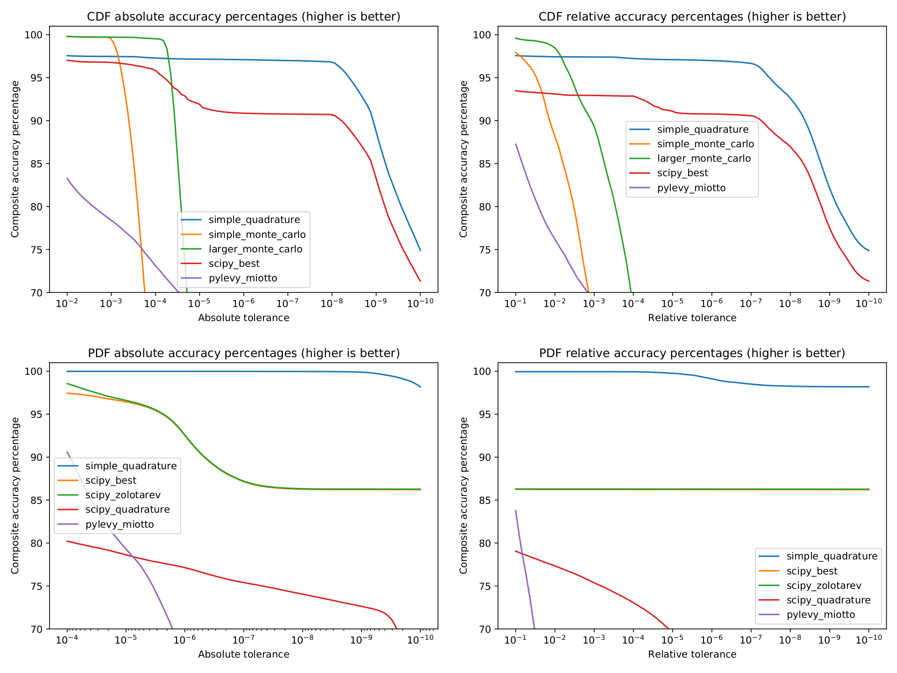

# levy-stable-benchmarks

Stable distributions (sometimes called Lévy alpha-stable distributions) are
important for modelling data across several disciplines including signal
processing, physics, and finance. Despite this, many Python libraries
provide buggy and/or inaccurate implementations for computing its PDF/CDF.

This repository attempts to define a benchmark to test the accuracy of
such implementations. We also provide some alternative calculation methods.

# Table of Contents
  * [CDF accuracy percentages](#CDFAccuracy)
  * [PDF accuracy percentages](#PDFAccuracy)
  * [FAQ, notes, and limitations](#FAQ)

## CDF accuracy percentages

### CDF table (-100 <= x <= 100)

<table>
  <tr><td></td><td colspan="4"><b>Absolute</b> Tolerance</td><td>Average Time Per Call</td></tr>
  <tr><td>Method</td><td>1E-2</td><td>1E-3</td><td>1E-4</td><td>1E-5</td><td></td></tr>
  <tr>
    <td>simple_quadrature</td>
    <td>100.0%</td><td>100.0%</td><td>99.6%</td><td>99.4%</td>
    <td>3.7 ms</td>
  </tr>
  <tr>
    <td>simple_monte_carlo</td>
    <td>100.0%</td><td>99.9%</td><td>73.6%</td><td>32.2%</td>
    <td>0.17 ms</td>
  </tr>
  <tr>
    <td>larger_monte_carlo</td>
    <td>100.0%</td><td>100.0%</td><td>99.6%</td><td>74.1%</td>
    <td>19 ms</td>
  </tr>
  <tr>
    <td>scipy_best</td>
    <td>99.7%</td><td>99.5%</td><td>97.0%</td><td>89.8%</td>
    <td>2.6 ms</td>
  </tr>
  <tr>
    <td>pylevy_miotto</td>
    <td>83.5%</td><td>78.0%</td><td>68.9%</td><td>58.1%</td>
    <td>1.3 ms</td>
  </tr>
</table>

<table>
  <tr><td></td><td colspan="4"><b>Relative</b> Tolerance</td><td>Average Time Per Call</td></tr>
  <tr><td>Method</td><td>1E-1</td><td>1E-2</td><td>1E-3</td><td>1E-4</td><td></td></tr>
  <tr>
    <td>simple_quadrature</td>
    <td>98.9%</td><td>98.9%</td><td>98.9%</td><td>98.6%</td>
    <td>3.7 ms</td>
  </tr>
  <tr>
    <td>simple_monte_carlo</td>
    <td>96.4%</td><td>77.4%</td><td>56.5%</td><td>38.3%</td>
    <td>0.17 ms</td>
  </tr>
  <tr>
    <td>larger_monte_carlo</td>
    <td>99.2%</td><td>97.1%</td><td>80.0%</td><td>56.7%</td>
    <td>19 ms</td>
  </tr>
  <tr>
    <td>scipy_best</td>
    <td>90.4%</td><td>90.4%</td><td>90.4%</td><td>90.1%</td>
    <td>2.6 ms</td>
  </tr>
  <tr>
    <td>pylevy_miotto</td>
    <td>81.8%</td><td>66.7%</td><td>54.0%</td><td>42.3%</td>
    <td>1.3 ms</td>
  </tr>
</table>

### CDF quantile table (0.001 <= p <= 0.999)

<table>
  <tr><td></td><td colspan="4"><b>Absolute</b> Tolerance</td><td>Average Time Per Call</td></tr>
  <tr><td>Method</td><td>1E-2</td><td>1E-3</td><td>1E-4</td><td>1E-5</td><td></td></tr>
  <tr>
    <td>simple_quadrature</td>
    <td>99.2%</td><td>99.2%</td><td>99.2%</td><td>99.2%</td>
    <td>3.4 ms</td>
  </tr>
  <tr>
    <td>simple_monte_carlo</td>
    <td>100.0%</td><td>99.5%</td><td>35.9%</td><td>3.8%</td>
    <td>0.17 ms</td>
  </tr>
  <tr>
    <td>larger_monte_carlo</td>
    <td>100.0%</td><td>100.0%</td><td>99.9%</td><td>30.2%</td>
    <td>19 ms</td>
  </tr>
  <tr>
    <td>scipy_best</td>
    <td>99.9%</td><td>99.9%</td><td>99.9%</td><td>99.9%</td>
    <td>2.5 ms</td>
  </tr>
  <tr>
    <td>pylevy_miotto</td>
    <td>85.9%</td><td>80.7%</td><td>78.8%</td><td>77.5%</td>
    <td>1.3 ms</td>
  </tr>
</table>

<table>
  <tr><td></td><td colspan="4"><b>Relative</b> Tolerance</td><td>Average Time Per Call</td></tr>
  <tr><td>Method</td><td>1E-1</td><td>1E-2</td><td>1E-3</td><td>1E-4</td><td></td></tr>
  <tr>
    <td>simple_quadrature</td>
    <td>99.3%</td><td>99.2%</td><td>99.2%</td><td>99.2%</td>
    <td>3.4 ms</td>
  </tr>
  <tr>
    <td>simple_monte_carlo</td>
    <td>100.0%</td><td>99.3%</td><td>74.9%</td><td>19.4%</td>
    <td>0.17 ms</td>
  </tr>
  <tr>
    <td>larger_monte_carlo</td>
    <td>100.0%</td><td>99.9%</td><td>99.5%</td><td>79.0%</td>
    <td>19 ms</td>
  </tr>
  <tr>
    <td>scipy_best</td>
    <td>99.9%</td><td>99.9%</td><td>99.9%</td><td>99.9%</td>
    <td>2.5 ms</td>
  </tr>
  <tr>
    <td>pylevy_miotto</td>
    <td>92.7%</td><td>83.0%</td><td>79.8%</td><td>78.1%</td>
    <td>1.3 ms</td>
  </tr>
</table>

### Nolan CDF quantile table (0.00001 <= p <= 0.99999)

<table>
  <tr><td></td><td colspan="4"><b>Absolute</b> Tolerance</td><td>Average Time Per Call</td></tr>
  <tr><td>Method</td><td>1E-2</td><td>1E-3</td><td>1E-4</td><td>1E-5</td><td></td></tr>
  <tr>
    <td>simple_quadrature</td>
    <td>96.4%</td><td>96.0%</td><td>95.8%</td><td>95.6%</td>
    <td>5.3 ms</td>
  </tr>
  <tr>
    <td>simple_monte_carlo</td>
    <td>99.4%</td><td>98.9%</td><td>55.6%</td><td>20.2%</td>
    <td>0.98 ms</td>
  </tr>
  <tr>
    <td>larger_monte_carlo</td>
    <td>99.4%</td><td>99.1%</td><td>98.9%</td><td>51.2%</td>
    <td>110 ms</td>
  </tr>
  <tr>
    <td>scipy_best</td>
    <td>99.1%</td><td>98.7%</td><td>97.9%</td><td>92.6%</td>
    <td>2.7 ms</td>
  </tr>
  <tr>
    <td>pylevy_miotto</td>
    <td>91.5%</td><td>87.9%</td><td>83.4%</td><td>77.7%</td>
    <td>1.3 ms</td>
  </tr>
</table>

<table>
  <tr><td></td><td colspan="4"><b>Relative</b> Tolerance</td><td>Average Time Per Call</td></tr>
  <tr><td>Method</td><td>1E-1</td><td>1E-2</td><td>1E-3</td><td>1E-4</td><td></td></tr>
  <tr>
    <td>simple_quadrature</td>
    <td>96.5%</td><td>95.9%</td><td>95.8%</td><td>95.6%</td>
    <td>5.3 ms</td>
  </tr>
  <tr>
    <td>simple_monte_carlo</td>
    <td>97.1%</td><td>87.5%</td><td>67.2%</td><td>29.4%</td>
    <td>0.98 ms</td>
  </tr>
  <tr>
    <td>larger_monte_carlo</td>
    <td>99.4%</td><td>98.0%</td><td>88.3%</td><td>67.8%</td>
    <td>110 ms</td>
  </tr>
  <tr>
    <td>scipy_best</td>
    <td>96.2%</td><td>95.8%</td><td>95.7%</td><td>95.4%</td>
    <td>2.7 ms</td>
  </tr>
  <tr>
    <td>pylevy_miotto</td>
    <td>93.7%</td><td>86.0%</td><td>79.5%</td><td>71.5%</td>
    <td>1.3 ms</td>
  </tr>
</table>

## PDF accuracy percentages

### PDF table (-100 <= x <= 100)

<table>
  <tr><td></td><td colspan="4"><b>Absolute</b> Tolerance</td><td>Average Time Per Call</td></tr>
  <tr><td>Method</td><td>1E-4</td><td>1E-5</td><td>1E-6</td><td>1E-7</td><td></td></tr>
  <tr>
    <td>simple_quadrature</td>
    <td>99.9%</td><td>99.9%</td><td>99.9%</td><td>99.9%</td>
    <td>3.0 ms</td>
  </tr>
  <tr>
    <td>scipy_best</td>
    <td>99.8%</td><td>98.8%</td><td>94.9%</td><td>89.5%</td>
    <td>7.2 ms</td>
  </tr>
  <tr>
    <td>scipy_zolotarev</td>
    <td>98.2%</td><td>96.6%</td><td>92.5%</td><td>87.2%</td>
    <td>5.7 ms</td>
  </tr>
  <tr>
    <td>scipy_quadrature</td>
    <td>82.6%</td><td>81.0%</td><td>79.5%</td><td>77.8%</td>
    <td>160 ms</td>
  </tr>
  <tr>
    <td>pylevy_miotto</td>
    <td>90.8%</td><td>79.8%</td><td>67.7%</td><td>37.5%</td>
    <td>1.3 ms</td>
  </tr>
</table>

<table>
  <tr><td></td><td colspan="4"><b>Relative</b> Tolerance</td><td>Average Time Per Call</td></tr>
  <tr><td>Method</td><td>1E-1</td><td>1E-2</td><td>1E-3</td><td>1E-4</td><td></td></tr>
  <tr>
    <td>simple_quadrature</td>
    <td>97.5%</td><td>97.5%</td><td>97.5%</td><td>97.5%</td>
    <td>3.0 ms</td>
  </tr>
  <tr>
    <td>scipy_best</td>
    <td>88.3%</td><td>88.3%</td><td>88.3%</td><td>88.2%</td>
    <td>7.2 ms</td>
  </tr>
  <tr>
    <td>scipy_zolotarev</td>
    <td>86.0%</td><td>86.0%</td><td>85.9%</td><td>85.8%</td>
    <td>5.7 ms</td>
  </tr>
  <tr>
    <td>scipy_quadrature</td>
    <td>78.1%</td><td>76.4%</td><td>74.4%</td><td>71.3%</td>
    <td>160 ms</td>
  </tr>
  <tr>
    <td>pylevy_miotto</td>
    <td>79.5%</td><td>48.8%</td><td>24.4%</td><td>11.5%</td>
    <td>1.3 ms</td>
  </tr>
</table>

### PDF quantile table (0.001 <= p <= 0.999)

<table>
  <tr><td></td><td colspan="4"><b>Absolute</b> Tolerance</td><td>Average Time Per Call</td></tr>
  <tr><td>Method</td><td>1E-4</td><td>1E-5</td><td>1E-6</td><td>1E-7</td><td></td></tr>
  <tr>
    <td>simple_quadrature</td>
    <td>99.1%</td><td>99.1%</td><td>99.1%</td><td>98.9%</td>
    <td>3.6 ms</td>
  </tr>
  <tr>
    <td>scipy_best</td>
    <td>99.9%</td><td>99.9%</td><td>99.9%</td><td>99.7%</td>
    <td>5.6 ms</td>
  </tr>
  <tr>
    <td>scipy_zolotarev</td>
    <td>97.5%</td><td>97.5%</td><td>97.4%</td><td>97.3%</td>
    <td>5.4 ms</td>
  </tr>
  <tr>
    <td>scipy_quadrature</td>
    <td>87.4%</td><td>86.6%</td><td>85.8%</td><td>84.9%</td>
    <td>85 ms</td>
  </tr>
  <tr>
    <td>pylevy_miotto</td>
    <td>85.4%</td><td>82.5%</td><td>77.5%</td><td>55.9%</td>
    <td>1.3 ms</td>
  </tr>
</table>

<table>
  <tr><td></td><td colspan="4"><b>Relative</b> Tolerance</td><td>Average Time Per Call</td></tr>
  <tr><td>Method</td><td>1E-1</td><td>1E-2</td><td>1E-3</td><td>1E-4</td><td></td></tr>
  <tr>
    <td>simple_quadrature</td>
    <td>98.4%</td><td>98.4%</td><td>98.4%</td><td>98.4%</td>
    <td>3.6 ms</td>
  </tr>
  <tr>
    <td>scipy_best</td>
    <td>99.9%</td><td>99.9%</td><td>99.9%</td><td>99.9%</td>
    <td>5.6 ms</td>
  </tr>
  <tr>
    <td>scipy_zolotarev</td>
    <td>99.0%</td><td>97.9%</td><td>97.5%</td><td>97.4%</td>
    <td>5.4 ms</td>
  </tr>
  <tr>
    <td>scipy_quadrature</td>
    <td>88.4%</td><td>87.5%</td><td>86.7%</td><td>86.0%</td>
    <td>86 ms</td>
  </tr>
  <tr>
    <td>pylevy_miotto</td>
    <td>85.2%</td><td>79.1%</td><td>77.7%</td><td>75.5%</td>
    <td>1.3 ms</td>
  </tr>
</table>

### Nolan PDF quantile table (0.00001 <= p <= 0.99999)

<table>
  <tr><td></td><td colspan="4"><b>Absolute</b> Tolerance</td><td>Average Time Per Call</td></tr>
  <tr><td>Method</td><td>1E-4</td><td>1E-5</td><td>1E-6</td><td>1E-7</td><td></td></tr>
  <tr>
    <td>simple_quadrature</td>
    <td>95.8%</td><td>95.8%</td><td>95.8%</td><td>95.7%</td>
    <td>11 ms</td>
  </tr>
  <tr>
    <td>scipy_best</td>
    <td>99.5%</td><td>99.4%</td><td>98.5%</td><td>96.3%</td>
    <td>9.7 ms</td>
  </tr>
  <tr>
    <td>scipy_zolotarev</td>
    <td>96.5%</td><td>96.3%</td><td>95.3%</td><td>93.0%</td>
    <td>5.6 ms</td>
  </tr>
  <tr>
    <td>scipy_quadrature</td>
    <td>79.4%</td><td>78.4%</td><td>77.5%</td><td>76.7%</td>
    <td>120 ms</td>
  </tr>
  <tr>
    <td>pylevy_miotto</td>
    <td>91.9%</td><td>87.0%</td><td>77.9%</td><td>54.4%</td>
    <td>1.3 ms</td>
  </tr>
</table>

<table>
  <tr><td></td><td colspan="4"><b>Relative</b> Tolerance</td><td>Average Time Per Call</td></tr>
  <tr><td>Method</td><td>1E-1</td><td>1E-2</td><td>1E-3</td><td>1E-4</td><td></td></tr>
  <tr>
    <td>simple_quadrature</td>
    <td>91.6%</td><td>91.6%</td><td>91.6%</td><td>91.4%</td>
    <td>11 ms</td>
  </tr>
  <tr>
    <td>scipy_best</td>
    <td>93.7%</td><td>93.7%</td><td>93.7%</td><td>93.6%</td>
    <td>9.7 ms</td>
  </tr>
  <tr>
    <td>scipy_zolotarev</td>
    <td>92.0%</td><td>90.8%</td><td>90.3%</td><td>90.2%</td>
    <td>5.6 ms</td>
  </tr>
  <tr>
    <td>scipy_quadrature</td>
    <td>78.7%</td><td>77.9%</td><td>77.1%</td><td>75.5%</td>
    <td>120 ms</td>
  </tr>
  <tr>
    <td>pylevy_miotto</td>
    <td>88.3%</td><td>79.8%</td><td>67.5%</td><td>55.3%</td>
    <td>1.3 ms</td>
  </tr>
</table>

## FAQ: notes and limitations

**This FAQ is not yet complete, but many of the questions have reasonably fleshed out answers so far.**

TODO: table of contents for FAQ?

##### How are "accuracy percentage" and "composite accuracy" defined?

"Accuracy percentage" is the percentage of tabulated values computed to the
desired tolerance.

When listed above, the accuracy percentages are truncated (not rounded), so a
method will only have 100.0% accuracy if it is within the specified tolerance
on *all* the test cases.

"Composite accuracy" is the average accuracy percentage on all the PDF or CDF
tables. There are three tables each for PDF and CDF, so ~33% of the weighting
goes to each.

##### Where did these PDF/CDF tables come from? Are they accurate?

TODO: Nolan quantile table definitely has inaccuracies in the tails and issues from their rounding, but this needs more testing to verify

##### What are some known limitations of this benchmark?

TODO: beta < 0 implementation is assumed correct (by symmetry)

TODO: behavior **very** far out (p < 0.00001) into the tails is not tested, but this is probably a minor concern in most applications

##### Why is the range of tested absolute tolerances different for CDF vs. PDF?

This is an ad-hoc choice. It was assumed that absolute accuracies of 0.01 for the CDF and 0.0001 for the PDF are near the lower end of usefulness.

It's worth noting that simply returning the normal distribution (with e.g. `norm.pdf(1, scale=sqrt(2))`) yields composite accuracies of ~20% and ~30% at this accuracy level for the PDF and CDF, respectively.

##### Where can I find the libraries tested?

There are six methods tested here. See the links below and the code in [algorithms](algorithms).

 * Our simple methods
   * [**simple_quadrature**](algorithms/simple_quadrature.py): direct numerical integration (TODO: reference the [integrand derivation](figures/simple_quadrature_derivation/simple_quadrature_derivation.pdf))
   * [**simple_monte_carlo**](algorithms/simple_monte_carlo.py): monte carlo scheme based on the [Chambers-Mallows-Stuck method of simulating stable random variables](https://doi.org/10.1080%2F01621459.1976.10480344)
   * **larger_monte_carlo**: same as simple_monte_carlo, but with a sample size of 100 million
 * Scipy's methods (tested on version 1.5.2)
   * [**scipy_best**](https://docs.scipy.org/doc/scipy/reference/generated/scipy.stats.levy_stable.html) with `pdf_default_method = "best"`
   * [**scipy_zolotarev**](https://docs.scipy.org/doc/scipy/reference/generated/scipy.stats.levy_stable.html) with `pdf_default_method = "zolotarev"`
   * [**scipy_quadrature**](https://docs.scipy.org/doc/scipy/reference/generated/scipy.stats.levy_stable.html) with `pdf_default_method = "quadrature"`
 * [**pylevy_miotto**](https://github.com/josemiotto/pylevy) (tested on commit [19fa983](https://github.com/josemiotto/pylevy/commit/19fa983437883f6abdb0ea59d1ea057cbc458c9c))
 * TODO: add the unofficial pystable_jones?

##### The literature is very inconsistent/fragmented with respect to parameterizing stable distributions. Are you sure the libraries are actually consistent in their calculations here?

Mark Veillette says this well:

> One of the most frustrating issues in dealing with alpha-stable distribtuions is that its parameterization is not consistent across the literature (there are over half a dozen parameterizations). [...] The most common way to specify a parameterization is to look at the characteristic function of the alpha-stable random variable.
>
> One further annoyance is that the names of the 4 parameters are also inconsistent. [...] The letters alpha and beta are used almost everywhere you look, while the other two parameters are almost always different.

To this end, we've written some [tests to prove our transformations are good](tests/parameterization_tests.py). At the moment, all the libraries here appear use either the S0 or S1 parameterization (in Nolan's notation).

##### simple_quadrature _usually_ seems accurate. When/where is it inaccurate?

Most notably, simple_quadrature can completely fail near x = ? (TODO) and in the tails when the oscillatory components of the integrand become incredibly unwieldy.

TODO: potential hybrid scheme with asymptotic tail laws? Should probably create a custom integrator for this purpose if accuracy is critical.

##### simple_monte_carlo appears far slower in practice than listed here. Why?

simple_monte_carlo is an incredibly inefficient method for computing the CDF in general. It must generate new random samples for each unique pair of (alpha, beta) values.

Here, the test tables include many repeated (alpha, beta) pairs, so the method appears to run more quickly *on average* than it otherwise might.

##### These methods vary greatly in their speed. What is a "good" average time per call? 

This is highly domain specific -- some applications might need very quick calculations and can tolerate large inaccuracies. Others might require high accuracy and have speed only as a secondary consideration. 

The tests here were run on a machine with a i7-9700K (8 cores, stock, up to 4.9 GHz) CPU and 16 GB DDR4 3200 MHz of RAM.

Nolan claims to have

> code to quickly approximate stable densities.  This routine is much faster than the regular density calculations: approximately 1 million density evaluations/second can be performed on a 1 GHz Pentium.

which appears to suggest that an average time per call of <1 us (!) is "easily" feasible on modern hardware. However, this is several orders of magnitude faster than any of the methods tested here.

##### Some of the methods only appear in the PDF or CDF tests. Why?

Some methods only support one or the other. In general, computing the CDF of this distribution is much easier than computing the PDF.

##### I know of a Python library that is missing from this benchmark. Can you add it?

Yes (assuming its publicly available), please raise an issue and I'll try to add it.