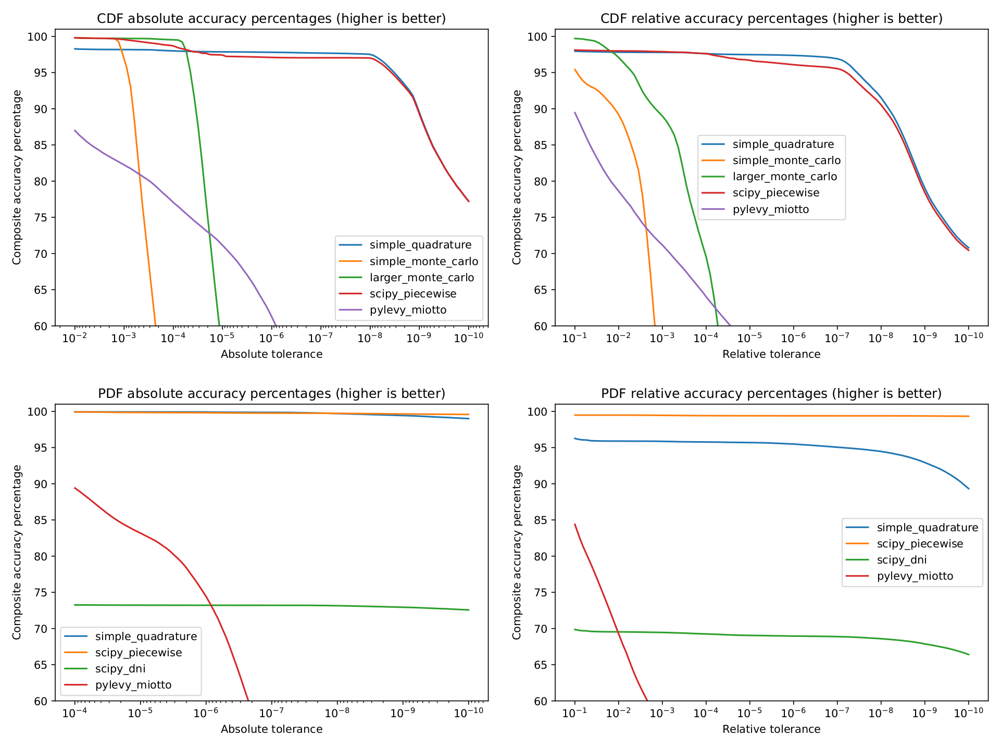

# levy-stable-benchmarks

Stable distributions (sometimes called Lévy alpha-stable distributions) are
important for modelling data across several disciplines including signal
processing, physics, and finance. Despite this, many Python libraries
provide buggy and/or inaccurate implementations for computing its PDF/CDF.

This repository attempts to define a benchmark to test the accuracy of such
implementations.

# Table of Contents
  * [CDF accuracy percentages](#CDFAccuracy)
  * [PDF accuracy percentages](#PDFAccuracy)
  * [FAQ, notes, and limitations](#FAQ)

## CDF accuracy percentages

### CDF table (-100 <= x <= 100)

<table>
  <tr><td></td><td colspan="4"><b>Absolute</b> Tolerance</td><td>Average Time Per Call</td></tr>
  <tr><td>Method</td><td>1E-2</td><td>1E-3</td><td>1E-4</td><td>1E-5</td><td></td></tr>
  <tr>
    <td>simple_quadrature</td>
    <td>99.9%</td><td>99.9%</td><td>99.6%</td><td>99.4%</td>
    <td></td>
  </tr>
  <tr>
    <td>simple_monte_carlo</td>
    <td>100.0%</td><td>99.9%</td><td>73.6%</td><td>32.2%</td>
    <td></td>
  </tr>
  <tr>
    <td>scipy_best</td>
    <td>97.8%</td><td>97.4%</td><td>95.4%</td><td>88.4%</td>
    <td></td>
  </tr>
  <tr>
    <td>pylevy_miotto</td>
    <td>83.4%</td><td>77.8%</td><td>68.1%</td><td>56.8%</td>
    <td></td>
  </tr>
  <tr>
    <td>pystable_jones</td>
    <td></td><td></td><td></td><td></td>
    <td></td>
  </tr>
</table>

<table>
  <tr><td></td><td colspan="4"><b>Relative</b> Tolerance</td><td>Average Time Per Call</td></tr>
  <tr><td>Method</td><td>1E-1</td><td>1E-2</td><td>1E-3</td><td>1E-4</td><td></td></tr>
  <tr>
    <td>simple_quadrature</td>
    <td>99.9%</td><td>99.9%</td><td>99.9%</td><td>99.6%</td>
    <td></td>
  </tr>
  <tr>
    <td>simple_monte_carlo</td>
    <td>96.5%</td><td>77.5%</td><td>56.6%</td><td>38.4%</td>
    <td></td>
  </tr>
  <tr>
    <td>scipy_best</td>
    <td>89.3%</td><td>88.9%</td><td>88.6%</td><td>88.6%</td>
    <td></td>
  </tr>
  <tr>
    <td>pylevy_miotto</td>
    <td>85.1%</td><td>69.4%</td><td>56.4%</td><td>44.5%</td>
    <td></td>
  </tr>
  <tr>
    <td>pystable_jones</td>
    <td></td><td></td><td></td><td></td>
    <td></td>
  </tr>
</table>

### Quantile table (0.001 <= p <= 0.999)

<table>
  <tr><td></td><td colspan="4"><b>Absolute</b> Tolerance</td><td>Average Time Per Call</td></tr>
  <tr><td>Method</td><td>1E-2</td><td>1E-3</td><td>1E-4</td><td>1E-5</td><td></td></tr>
  <tr>
    <td>simple_quadrature</td>
    <td>98.6%</td><td>98.6%</td><td>98.5%</td><td>98.5%</td>
    <td></td>
  </tr>
  <tr>
    <td>simple_monte_carlo</td>
    <td>100.0%</td><td>99.5%</td><td>35.9%</td><td>3.8%</td>
    <td></td>
  </tr>
  <tr>
    <td>scipy_best</td>
    <td>97.5%</td><td>97.5%</td><td>97.5%</td><td>97.5%</td>
    <td></td>
  </tr>
  <tr>
    <td>pylevy_miotto</td>
    <td>83.3%</td><td>78.0%</td><td>76.2%</td><td>75.0%</td>
    <td></td>
  </tr>
  <tr>
    <td>pystable_jones</td>
    <td></td><td></td><td></td><td></td>
    <td></td>
  </tr>
</table>

<table>
  <tr><td></td><td colspan="4"><b>Relative</b> Tolerance</td><td>Average Time Per Call</td></tr>
  <tr><td>Method</td><td>1E-1</td><td>1E-2</td><td>1E-3</td><td>1E-4</td><td></td></tr>
  <tr>
    <td>simple_quadrature</td>
    <td>98.6%</td><td>98.6%</td><td>98.6%</td><td>98.5%</td>
    <td></td>
  </tr>
  <tr>
    <td>simple_monte_carlo</td>
    <td>100.0%</td><td>99.3%</td><td>74.9%</td><td>19.4%</td>
    <td></td>
  </tr>
  <tr>
  <tr>
    <td>scipy_best</td>
    <td>97.6%</td><td>97.5%</td><td>97.5%</td><td>97.5%</td>
    <td></td>
  </tr>
  <td>pylevy_miotto</td>
    <td>90.8%</td><td>80.8%</td><td>77.5%</td><td>75.7%</td>
    <td></td>
  </tr>
  <tr>
    <td>pystable_jones</td>
    <td></td><td></td><td></td><td></td>
    <td></td>
  </tr>
</table>

### Nolan Quantile table (0.00001 <= p <= 0.99999)

<table>
  <tr><td></td><td colspan="4"><b>Absolute</b> Tolerance</td><td>Average Time Per Call</td></tr>
  <tr><td>Method</td><td>1E-2</td><td>1E-3</td><td>1E-4</td><td>1E-5</td><td></td></tr>
  <tr>
    <td>simple_quadrature</td>
    <td>94.0%</td><td>93.8%</td><td>93.6%</td><td>93.4%</td>
    <td></td>
  </tr>
  <tr>
    <td>simple_monte_carlo</td>
    <td>99.4%</td><td>98.9%</td><td>55.6%</td><td>20.2%</td>
    <td></td>
  </tr>
  <tr>
    <td>scipy_best</td>
    <td>95.6%</td><td>95.2%</td><td>94.7%</td><td>89.6%</td>
    <td></td>
  </tr>
  <tr>
    <td>pylevy_miotto</td>
    <td>83.0%</td><td>79.2%</td><td>74.9%</td><td>69.7%</td>
    <td></td>
  </tr>
  <tr>
    <td>pystable_jones</td>
    <td></td><td></td><td></td><td></td>
    <td></td>
  </tr>
</table>

<table>
  <tr><td></td><td colspan="4"><b>Relative</b> Tolerance</td><td>Average Time Per Call</td></tr>
  <tr><td>Method</td><td>1E-1</td><td>1E-2</td><td>1E-3</td><td>1E-4</td><td></td></tr>
  <tr>
    <td>simple_quadrature</td>
    <td>94.1%</td><td>93.7%</td><td>93.6%</td><td>93.4%</td>
    <td></td>
  </tr>
  <tr>
    <td>simple_monte_carlo</td>
    <td>97.1%</td><td>87.5%</td><td>67.2%</td><td>29.4%</td>
    <td></td>
  </tr>
  <tr>
    <td>scipy_best</td>
    <td>93.4%</td><td>92.7%</td><td>92.5%</td><td>92.3%</td>
    <td></td>
  </tr>
  <tr>
  <td>pylevy_miotto</td>
    <td>85.8%</td><td>78.3%</td><td>73.5%</td><td>67.5%</td>
    <td></td>
  </tr>
  <tr>
    <td>pystable_jones</td>
    <td></td><td></td><td></td><td></td>
    <td></td>
  </tr>
</table>

## PDF accuracy percentages

### PDF table (-100 <= x <= 100)

<table>
  <tr><td></td><td colspan="4"><b>Absolute</b> Tolerance</td><td>Average Time Per Call</td></tr>
  <tr><td>Method</td><td>1E-4</td><td>1E-5</td><td>1E-6</td><td>1E-7</td><td></td></tr>
  <tr>
    <td>simple_quadrature</td>
    <td>99.9%</td><td>99.9%</td><td>99.9%</td><td>99.9%</td>
    <td></td>
  </tr>
  <tr>
    <td>scipy_best</td>
    <td>97.4%</td><td>96.4%</td><td>92.5%</td><td>87.1%</td>
    <td></td>
  </tr>
  <tr>
    <td>scipy_zolotarev</td>
    <td>98.5%</td><td>96.6%</td><td>92.5%</td><td>87.2%</td>
    <td></td>
  </tr>
  <tr>
    <td>scipy_quadrature</td>
    <td>80.2%</td><td>78.6%</td><td>77.1%</td><td>75.4%</td>
    <td></td>
  </tr>
  <tr>
    <td>pylevy_miotto</td>
    <td>90.5%</td><td>79.2%</td><td>66.4%</td><td>36.4%</td>
    <td></td>
  </tr>
  <tr>
    <td>pystable_jones</td>
    <td></td><td></td><td></td><td></td>
    <td></td>
  </tr>
</table>

<table>
  <tr><td></td><td colspan="4"><b>Relative</b> Tolerance</td><td>Average Time Per Call</td></tr>
  <tr><td>Method</td><td>1E-1</td><td>1E-2</td><td>1E-3</td><td>1E-4</td><td></td></tr>
  <tr>
    <td>simple_quadrature</td>
    <td>99.9%</td><td>99.9%</td><td>99.9%</td><td>99.9%</td>
    <td></td>
  </tr>
  <tr>
    <td>scipy_best</td>
    <td>86.2%</td><td>86.2%</td><td>86.2%</td><td>86.2%</td>
    <td></td>
  </tr>
  <tr>
    <td>scipy_zolotarev</td>
    <td>86.2%</td><td>86.2%</td><td>86.2%</td><td>86.2%</td>
    <td></td>
  </tr>
  <tr>
    <td>scipy_quadrature</td>
    <td>79.0%</td><td>77.3%</td><td>75.3%</td><td>73.0%</td>
    <td></td>
  </tr>
  <tr>
    <td>pylevy_miotto</td>
    <td>83.7%</td><td>51.9%</td><td>27.5%</td><td>15.0%</td>
    <td></td>
  </tr>
  <tr>
    <td>pystable_jones</td>
    <td></td><td></td><td></td><td></td>
    <td></td>
  </tr>
</table>

## FAQ: notes and limitations

TODO: table of contents for FAQ?

##### How are "accuracy percentage" and "composite accuracy" defined?

TODO: truncated, not rounded. composite accuracy?

##### Where did these PDF/CDF tables come from? Are they accurate?

TODO: Nolan quantile table may have some inaccuracies

##### What are some known limitations of this benchmark?

##### Why is the range of tested absolute tolerances different for CDF vs. PDF?

##### Where can I find the libraries tested?

TODO: large_monte_carlo?

##### pylevy_miotto appears somewhat accurate in practice. Why does it perform so poorly in this benchmark?

TODO: pylevy_miotto parameter limitations

##### simple_quadrature seems very accurate. Is this always the case?

TODO: simple_quadrature limitations and potential hybrid scheme

##### These methods vary greatly in their speed. What is a "good" average time per call? 

##### Some of the methods only appear in the PDF or CDF tests. Why?